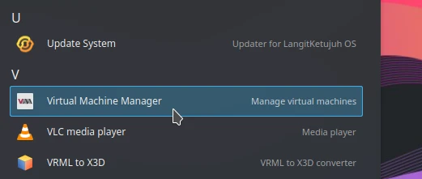
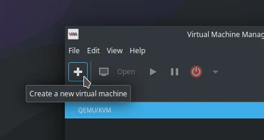
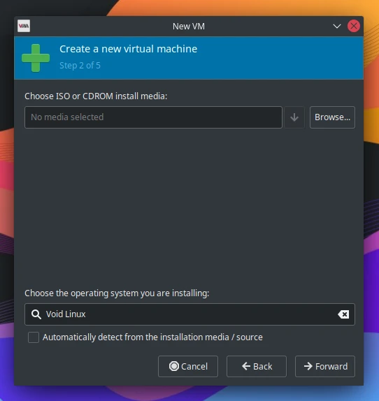
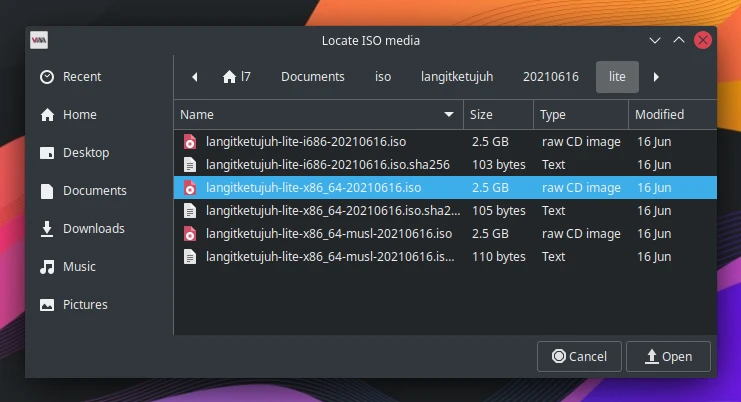
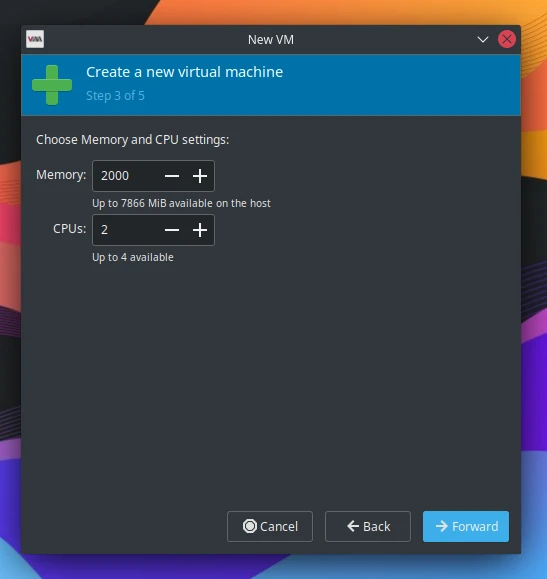

# Virt Manager

## Deskripsi

`virt-manager` merupakan aplikasi untuk mengatur virtualisasi secara mudah dengan GUI. Teknologi virtualisasi menggunakan KVM (Kernel Vital Machine) di kernel linux.

## Memasang Virt Manager

```
doas xbps-install virt-manager virt-manager-tools qemu
```

## Mengaktifkan layanan virtualisasi

```
doas ln -s /etc/sv/libvirtd /var/service
doas ln -s /etc/sv/virtlockd /var/service
doas ln -s /etc/sv/virtlogd /var/service
```

Gunakan vsv untuk melihat layanan yang berjalan.

```
doas vsv status virt
```

Contoh keluarannya seperti berikut ini.
```
➜  ~ doas vsv status virt

   SERVICE              STATE   ENABLED   PID      COMMAND           TIME
 ✔ libvirtd             run     true      5079     libvirtd          22 seconds
 ✔ virtlockd            run     true      5217     virtlockd         16 seconds
 ✔ virtlogd             run     true      5232     virtlogd          10 seconds
```

## Tambahkan pengguna ke grup kvm

```
doas gpasswd -a "$USER" libvirt
doas usermod -aG kvm "$USER"
```

Modprobe untuk mesin 32-bit (i686)

```
modprobe kvm-intel  # untuk Intel CPUs
modprobe kvm-amd    # untuk AMD CPUs
```

Pemasangan virt-manager sudah selesai.

## Penggunaan Virt Manager

Buka "Virtual Machine Manager" di menu.



Tambahkan mesin virtual baru.



Pilih lokal install. Klik _Forward_ untuk melanjutkan.


Hapus ceklis _Automatic detect_. Pilih "Voidlinux" sebagai sistem operasinya.



Klik _Browse_. Lalu muncul dialog untuk membuat virtual disk. Klik _Browse Local_. Pilih ISO yang dikehendaki.



Klik _Forward_ untuk melanjutkan.


Jika ada peringatan akses alamat _permission_ seperti ini. Pilih `Yes` saja.


Isikan memori yang dikehendaki, misalnya `2000` Mib (2Gib). Isikan jumlah CPU yang tersedia, misalnya `2` CPU. Klik _Forward_ untuk melanjutkan.



Isikan jumlah penyimpanan mesin virtual. Misalnya `30` GiB. Klik _Forward_ untuk melanjutkan.


Berikan nama mesin virtualnya. `langitketujuh` sebagai contoh. Klik `Finish` untuk melanjutkan.


Proses booting sedang berjalan hingga masuk ke desktop mesin virtual. Selesai.


Dikarenakan virt-manager menggunakan KVM di kernel linux, maka proses layanan cenderung lebih ringan dari pada mesin virtual lainnya.
