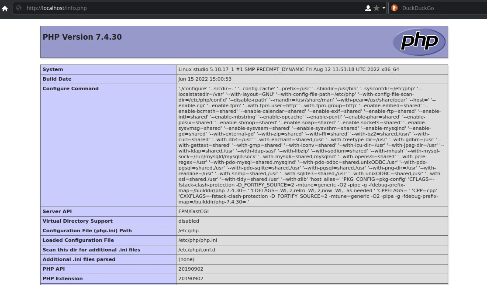

# Nginx server

## Deskripsi

[Nginx] (baca: enjin-eks) merupakan web server yang berfungsi sebagai reverse proxy, penyeimbang beban HTTP, dan proxy email untuk IMAP, POP3, dan SMTP. Nginx banyak digemari karena cukup stabil, hemat resource dan cocok untuk server dengan spesifikasi rendah.

## Cara memasang

```sh
get nginx
```

## Hak akses

Beri hak akses `http` dan `nginx` untuk pengguna.

```sh
doas usermod -a -G http,nginx $USER
```

## Konfigurasi `nginx.conf`

```sh
doas vim /etc/nginx/nginx.conf
```

Tambahkan `index.php`, menjadi seperti ini:

```sh
index  index.html index.htm index.php;
```

Hapus komentar di bagian pass the PHP scripts to FastCGI server, dan ganti `/scripts` menjadi `/usr/share/nginx/html`:

```sh
fastcgi_param  SCRIPT_FILENAME  /usr/share/nginx/html$fastcgi_script_name;
```

Kurang lebih pengaturan nginx.conf seperti dibawah ini. Hanya yang perlu menghapus tanda `#` pagar bagian `location ~ \.php$` dan mengganti 2 baris diatas. Tujuannya agar nginx dapat menjalankan skrip php melalui php-fpm.

```sh
    server {
        listen       80;
        server_name  localhost;

        location / {
            root   /usr/share/nginx/html;
            index  index.html index.htm index.php;
        }

        error_page   500 502 503 504  /50x.html;
        location = /50x.html {
            root   /usr/share/nginx/html;
        }

        location ~ \.php$ {
            root           html;
            fastcgi_pass   127.0.0.1:9000;
            fastcgi_index  index.php;
            fastcgi_param  SCRIPT_FILENAME  /usr/share/nginx/html$fastcgi_script_name;
            include        fastcgi_params;
        }
    }
```

## Aktifkan layanan

```sh
doas ln -s /etc/sv/nginx /var/service/
```

Restart juga layanan php-fpm

```sh
doas sv restart php-fpm
```

Cek status layanan

```sh
doas vsv
```

```sh
   SERVICE              STATE   ENABLED   PID      COMMAND           TIME
 ✔ nginx                run     true      822      nginx: master pro 1 hour
 ✔ php-fpm              run     true      3839     php-fpm.conf)     1 hour
```

## Halaman localhost

Anda dapat mengakses halaman nginx di <http://localhost>.


## Membuat info.php

Untuk menguji web server dapat menjalankan php, buatlah skrip `info.php`.

```sh
doas vim /usr/share/nginx/html/info.php
```

Isi dengan syntax berikut ini

```sh
<?php
  phpinfo();
?>
```

Pengguna dapat mengaksesnya di <http://localhost/info.php>.



## Membuat proyek baru

Pada umumnya untuk distribusi linux menggunakan apache sebagai web server. Tetapi di panduan LangitKetujuh menggunakan nginx, sehingga direktori proyek tidak sama dengan apache. Jika biasanya direktori proyek diletakkan di `/var/www/html`, tetapi di nginx diletakkan ke `/usr/share/nginx/html/`. Semua proyek diharapkan ditaruh di direktori tersebut seperti konfigurasi bawaannya, meskipun pengguna dapat mengganti pengaturan alamat jalur server dimana direktori proyek dapat disimpan.

Agar lebih mudah mengakses direktori localhost, beri hak akses untuk pengguna.

```sh
doas chown -R $USER:$USER /usr/share/nginx/html/
```

Sebagai contoh membuat nama proyek `myapps`, `webapps`, `wordpress` atau proyek lain. Anda dapat membukanya di <http://localhost/myapps>, <http://localhost/webapps>, <http://localhost/wordpress> dan sebagainya.

```sh
tree /usr/share/nginx/html/
```

```sh
/usr/share/nginx/html/
├── 50x.html
├── index.html
├── info.php
├── myapps
├── webapps
└── wordpress
```

[Nginx]:https://nginx.org/
