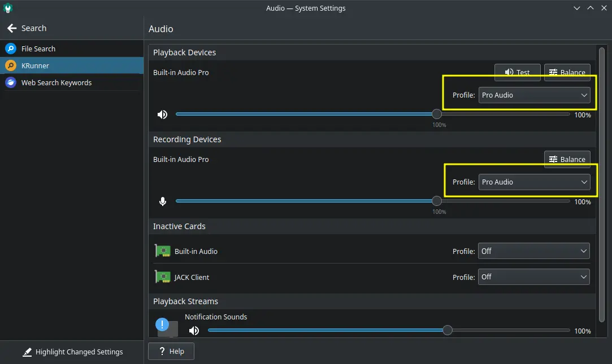
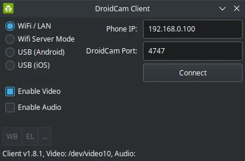
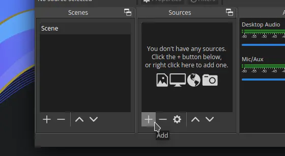
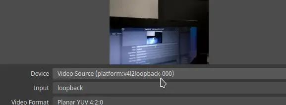
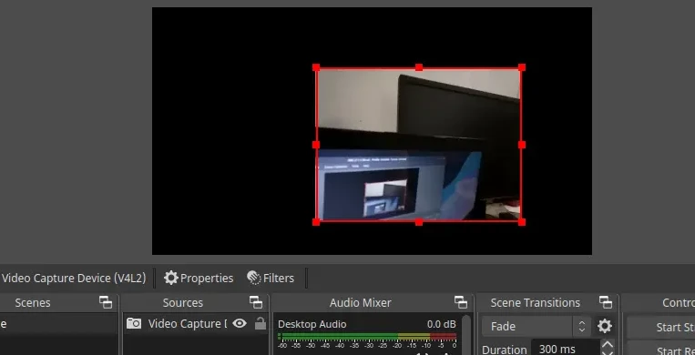

# DroidCam

## Deskripsi

Perangkat lunak ini bertujuan untuk menghubungkan kamera di smartphone/tablet melalui jaringan untuk dijadikan kamera utama untuk perangkat lunak desktop, misalnya untuk OBS Studio dan perangkat lunak konferensi. Ini memudahkan pengguna agar menggunakan kamera yang lebih jernih dari pada kamera Webcam sendiri atau untuk menggantikan webcam di komputer.

## Pemasangan

```sh
doas xbps-install -S droidcam l7-v4l2loopback
```

Cek versi kernel linux yang digunakan.

```sh
uname -r
```

jika hasilnya `5.15.11_1` berarti menggunakan kernel `linux5.15` (diambil dari angka versi sebelum 2 titik). Lalu konfigurasi ulang kernel agar mengkompilasi ulang setiap modul.

```sh
doas xbps-reconfigure -v linux5.15 -f
```

Kemudian reboot.

## Mengaktifkan audio (opsional)

Mengaktifkan audio di droidcam sepertinya tidak perlu karena biasanya sudah ada microphone untuk pengguna laptop, maka sebaiknya diabaikan saja. Tetapi jika menggunakan komputer yang tidak memiliki microphone dan ingin mengaktifkan audio di droidcam, maka aktifkan modul `snd-aloop`dengan cara sebagai berikut:

```sh
echo "snd-aloop" | doas tee /etc/modules-load.d/snd-aloop.conf
```
Kemudian reboot. Khusus pengguna `nvidia` terkadang mengaktifkan modul `snd-aloop` volume suaranya tidak berfungsi, tetapi untuk `intel` atau `amd` tidak ada masalah.

Selanjutnya, buka pengaturan sistem `Audio`, ganti profil `Analog Stereo Duplex` menjadi `Pro Audio`. Perlu diketahui, pergantian profil `Pro Audio` volumenya menjadi sedikit lebih rendah dari sebelumnya.



## Menjalankan DroidCam

Jalankan aplikasi android `DroidCam` atau `DroidCamX` (berbayar). Pengguna dapat mengunduh aplikasi ini di Google Play atau App Store.

Kemudian jalankan DroidCam di komputer. Samakan alamat IP dan port di smartphone, misalnya `192.168.0.100` port `4747`. Aktifkan `Enable Video`, Lalu klik `Connect`.



Pastikan video dan audionya sudah terdeteksi di statusbar bawah, sebagai contoh: `Video: /dev/video10, Audio:`.

## Menghubungkan dengan OBS Studio

Buka OBS Studio di menu. Klik ikon `+` dibagian Source.



Pilih `Video Capture Device (V4L2)`. Kemudian klik OK.


Pada bagian Device, pilih `Video Source`. Klik OK.



Hasil dari kamera wireless droidcam akan tampil. Pengguna dapat menambahkan ornamen dan gambar (`+` > `Image`) di bagian source agar lebih dekoratif.


